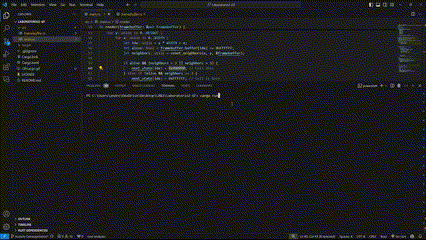

# Conway's Game of Life in Rust

This project implements Conway's Game of Life on a 100x100 grid using Rust and the `minifb` library for rendering. It features multiple starting patterns which animate and interact according to the classic rules of the game.

## Gifs

*Gameplay of Conway's Game of Life*

*Visual representation of the code running*
## Prerequisites

To run this simulation, you need to have Rust installed on your machine. If Rust is not installed, you can install it from the [official website](https://www.rust-lang.org/tools/install).

## Installation

1. **Clone the repository:**
git clone <repository-url>
cd path-to-repository

2. **Build the project:**
cargo build

## Running the Simulation

To run the simulation, execute the following command in the root of the project directory:
cargo run

This will open a window displaying the Game of Life simulation running with predefined patterns on a 100x100 grid.

## Simulation Details

The simulation includes several predefined patterns:
- **Glider**
- **Bee Hive**
- **Loaf**
- **Boat**
- **Tub**
- **Blinker**
- **Toad**
- **Beacon**
- **Lightweight Spaceship (LWSS)**
- **Block**

Each pattern is placed strategically on the grid to ensure visibility and interaction.

### Pattern Movement

Patterns are initialized with slight offsets to allow them to move across the grid without overlapping immediately. The grid edges are treated as boundaries with cells beyond the edges considered "dead."

### Game Rules

The game follows the standard rules of Conway's Game of Life:
- Any live cell with fewer than two live neighbors dies, as if by underpopulation.
- Any live cell with two or three live neighbors lives on to the next generation.
- Any live cell with more than three live neighbors dies, as if by overpopulation.
- Any dead cell with exactly three live neighbors becomes a live cell, as if by reproduction.

## Customization

You can customize the patterns and their initial positions by modifying the `initialize_game_of_life` function in the `main.rs` file. Adjust the coordinates and pattern arrays as needed.

## License

This project is licensed under the MIT License - see the [LICENSE](LICENSE) file for details.
